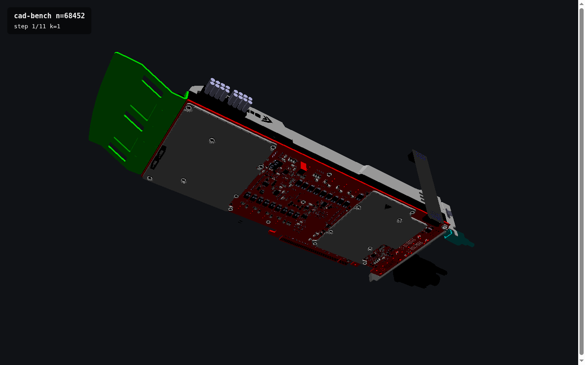
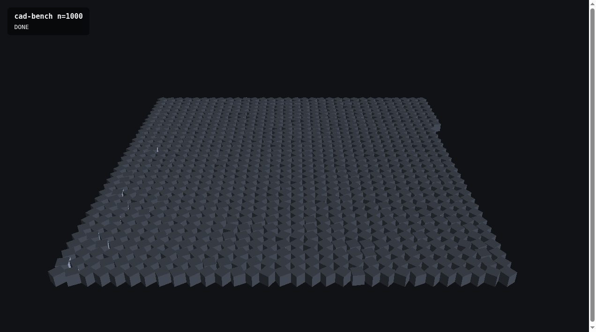

# aardvark-cad-bench

Change-density benchmark for the Aardvark.Portable / wombat (WebGPU) stack —
the measurement behind the thesis *"frequency tracked, not declared: cost
proportional to what actually changed."*

## What it measures

A synthetic CAD-like assembly of **N parts**, each its own scene node with an
adaptive per-part transform (`cval<Trafo3d>`). The input is deliberately
**naive**: no instancing hints, no merging, no baking — one node per part, the
way a domain user writes it.

The sweep edits **k random parts per frame** (one transaction) for
log-spaced k ∈ {1, 3, 10, …, N} and records, per frame:

- `frameMs` — rAF frame-to-frame delta (includes render)
- `editMs`  — wall time of the transaction (adaptive propagation)

The **k = N** step is the *"everything, all the time"* reference: the cost a
two-bucket engine pays at any density for content it classified as dynamic.

Modes:

- **synthetic** (default, `?n=N`) — a grid of N boxes, arbitrary scale.
- **`?model=geforce`** — the real NVIDIA nvpro-samples **GeForce board**
  cadscene (`assets/geforce.csf`, fetched from NVIDIA's server): 110 unique
  geometries → 2 497 drawable nodes (5 004 hierarchy nodes, ~2.6× geometric
  instancing, max 800 instances of one geometry), 218 604 vertices /
  248 569 triangles.
- **`?model=geforce-parts`** — the same board at **part granularity**:
  every node split into its CSF parts → **68 452 individually-editable
  objects** (22 514 unique part geometries, each with its own compact
  vertex/index buffers).
- **`?model=worldcar`** — the nvpro **worldcar** cadscene: 576 geometries
  → 1 811 drawable nodes, 1.82 M vertices / 2.33 M triangles (3.7 M
  instanced) — geometrically ~9× heavier than the board.

`tools/csf_convert.py` converts a CSF into web-loadable buffers. The
input stays **truly naive**: on load every unique object gets its own
fresh vertex/normal/index buffers (no packing, no cross-object sharing);
instances of the same object share their geometry, nothing else. Every
drawable object gets its own `cval<Trafo3d>` + material color. Two CSF
gotchas the converter handles: the baked `worldTM` block is
uninitialized in these assets (world transforms are recomputed by
walking the hierarchy, as the nvpro loader does), and some material
color blocks are garbage (sanitized to grey).



## Run

```bash
dotnet tool restore && npm install
# model modes: fetch + convert the cadscenes once
for m in geforce worldcar; do
  curl -o assets/$m.csf.gz https://developer.download.nvidia.com/ProGraphics/nvpro-samples/$m.csf.gz
  gunzip assets/$m.csf.gz
done
python3 tools/csf_convert.py assets/geforce.csf assets/geforce
python3 tools/csf_convert.py assets/geforce.csf assets/geforce-parts --parts
python3 tools/csf_convert.py assets/worldcar.csf assets/worldcar
npm run dev          # vite on :5173
# browser: http://localhost:5173/?n=5004&frames=60&warmup=20
#          http://localhost:5173/?model=geforce
# headless: node driver/run.cjs "http://localhost:5173/?model=geforce" results/geforce
python3 tools/aggregate.py results/*.csv
```

URL params: `n` (parts, synthetic), `model=geforce`, `frames` (measured
frames per step), `warmup`.
Results land in `window.__benchCsv` / `__benchMeta` (`__benchDone` flags
completion); the driver saves CSV + meta + screenshot.

## Findings on the published packages (prerelease0003 + npm wombat 0.17.x)

- **`DefaultSurfaces.trafo` is CAMERA-ONLY** — it reads `ViewProjTrafo`
  with no model term, so per-part `Sg.Trafo` placement silently never
  reaches the screen with the stock shader (the values flow fine; the
  runtime supplies `ModelTrafo`/`ModelViewProjTrafo`). The bench uses a
  custom `[<ShaderEffect>]` vertex shader consuming `ModelViewProjTrafo`.
  (An earlier revision of this README mis-diagnosed this as the engine
  dropping model trafos — it was the shader all along.)
- **Nested trafo scopes compose in REVERSE order** relative to the
  Aardvark.Dom convention on this version combination: an outer
  `Sg.Translate` + inner `Sg.Trafo(rotation)` yields `R·T·p` (positions
  swept along arcs about the origin) instead of `T·R·p` (parts rotating
  in place). The bench sidesteps it with ONE composed trafo per part.
- `Sg.Scale(float)` calls a missing `Trafo3d.scalingUniform` (runtime
  error); avoided.
- **The 68 k-object mode found a real engine bug** (fixed in
  `wombat.rendering 0.19.18`, required by this bench): the heap
  allocator's debug overlap-validation scanned every live allocation
  per alloc — O(n²) scene build, 65 s at 20 k objects and a renderer
  crash at 68 k. Now opt-in (`globalThis.__wombatDebugAllocOverlap`);
  the 68 452-object scene builds in ~1 s.

## First results

`results/summary.csv`; median over 51 frames/step (RTX 5060, Chromium WebGPU):

| n | k=1 | k=100 | k=1000 | k=3162 | k=n ("everything") |
|---|---|---|---|---|---|
| 5 004 — edit ms | 0.1 | 0.9 | 7.9 | 30.0 | 46.6 |
| 5 004 — frame ms | 16.6 | 16.8 | 16.6 | 32.3 | 49.9 |
| 20 000 — edit ms | 0.1 | 1.0 | 10.7 | 37.0 | 207.3 |
| 20 000 — frame ms | 16.7 | 16.8 | 16.5 | 41.8 | 215.6 |

Real models (medians over 61 frames):

| model | n | k=1 | k=100 | k=1000 | k=10000 | k=n ("everything") |
|---|---|---|---|---|---|---|
| geforce — edit ms | 2 497 | 0.1 | 0.8 | 6.2 | — | 16.5 |
| geforce — frame ms | 2 497 | 16.7 | 16.8 | 16.7 | — | 18.1 |
| worldcar — edit ms | 1 811 | 0.1 | 0.7 | 6.0 | — | 11.1 |
| worldcar — frame ms | 1 811 | 16.8 | 16.8 | 16.8 | — | 16.9 |
| geforce-parts — edit ms | 68 452 | 0.1 | 0.9 | 7.6 | 80.6 | 554.4 |
| geforce-parts — frame ms | 68 452 | 16.6 | 16.7 | 16.3 | 95.2 | 600.0 |

The headline is **geforce-parts**: a real CAD assembly with 68 452
individually-editable objects stays **vsync-bound (60 fps) while editing
up to ~1 000 parts per frame** (~1.5 % change density), while the
"everything, all the time" reference costs 600 ms/frame (1.7 fps) — a
**6 000× span** between sparse-edit and full-update cost, on real data.
worldcar (2.3 M unique triangles, ~9× the board's geometry) confirms
frame cost is geometry-independent at low k: vsync-bound at every
density, with the same ~6–10 µs/edit propagation cost.

Reading: at 20 000 parts the "everything, all the time" reference costs
215 ms/frame (≈4.6 fps); sparse edits cost 0.1 ms and the frame stays
vsync-bound (60 fps) up to ~1 000 edited parts/frame (~5 % density) —
a ~2 000× span between sparse-edit and full-update cost, widening with n.
The crossover where per-change tracking stops paying sits between 5 % and
15 % change density — the honest line in the central figure.



## .NET bench (Aardvark.Rendering, Vulkan, no vsync)

`dotnet/` runs the same sweep one level lower on **Aardvark.Rendering**
(.NET, Vulkan, `5.7.0-prerelease0002`): no window, no Aardium
presentation (which blits every frame through a memory-mapped file) —
render objects are built directly (no scene graph), compiled to an
`IRenderTask` and explicitly `Run()` into an **offscreen FBO** every
frame. GPU time comes from an `ITimeQuery` passed via `RenderToken`;
its blocking `GetResult` doubles as the frame sync, so `frameMs` is
true end-to-end frame cost, not a vsync-clamped rAF delta. Same
converted assets, same edit pattern, extra `gpuMs` CSV column.

`--heap` activates the prerelease **heap renderer**
(`HeapConfig.Enabled` + `Heap.ofRenderObjects`): the N per-part render
objects collapse into ONE bucket per effect, drawn as a single indirect
multidraw against a shared arena through the auto-rewritten shader —
the .NET equivalent of the wombat/WebGPU heap path. Output verified
pixel-identical to the classic path (worldcar) on the same
deterministic edit sequence.

```bash
cd dotnet
dotnet run -c Release -- --model geforce-parts --out ../results/vk-geforce-parts.csv
dotnet run -c Release -- --model geforce-parts --heap --out ../results/vk-heap-geforce-parts.csv
```

Classic vs heap (medians, frame / edit / gpu ms; RTX 5060, Vulkan):

| model | n | k | classic | heap (1 bucket) | frame speedup |
|---|---|---|---|---|---|
| geforce-parts | 68 452 | 1 | 31.7 / 0.02 / 11.7 | **0.74** / 0.02 / **0.40** | **43×** |
| | | 1 000 | 45.3 / 6.3 / 12.1 | 4.4 / 2.4 / 0.41 | 10× |
| | | 10 000 | 219 / 77 / 17.4 | 45.7 / 29.2 / 0.44 | 4.8× |
| | | 68 452 | 923 / 429 / 44.8 | 125 / 103 / 0.44 | 7.4× |
| synthetic | 20 000 | 1 | 8.2 / 0.02 / 3.4 | 0.45 / 0.02 / 0.14 | 19× |
| | | 20 000 | 219 / 99 / 3.4 | 16.9 / 15.9 / 0.15 | 13× |
| worldcar | 1 811 | 1 | 1.4 / 0.02 / 0.8 | 0.92 / 0.02 / 0.57 | 1.5× |
| | | 1 811 | 11.5 / 4.9 / 0.8 | 4.6 / 2.3 / 0.57 | 2.5× |

What the uncapped numbers show:

- **The heap renderer draws the 68 452-part board in 0.74 ms
  (0.40 ms GPU) — ~1 350 fps** — where the classic per-draw path needs
  31.7 ms. Object-count overhead (~0.5 µs/draw on the older GL run,
  ~0.17 µs effective on Vulkan classic) simply disappears when 68 452
  draws collapse into one indirect multidraw: GPU time becomes flat
  (0.40–0.44 ms) at EVERY change density, including k = N.
- **Object count, not triangle count, drives the classic per-draw
  cost**: worldcar's 2.33 M triangles in 1 811 draws render in 0.8 ms
  GPU; the board's 0.25 M triangles in 68 452 draws take 11.7 ms GPU.
  The many-small-parts CAD problem in one row — and the heap path
  erases it.
- **First frame at 68 k objects: classic Vulkan 55.7 s vs heap
  3.0 s** (the per-RO descriptor/command compile is the bottleneck,
  not the upload).
- Even at k = N (everything changes), heap wins 7×: one arena upload
  + 1 indirect draw vs 68 452 uniform-buffer updates + draws.
- Sparse edits cost ~2.4 µs/edit (.NET) vs ~7 µs (JS port); a k=1
  edit is 20 µs end to end.

(An earlier GL 5.6.5 run of the classic path — `results/dotnet-*.csv` —
matches the Vulkan classic numbers closely: 33 ms k=1 frame at 68 k,
367 ms k=N.)

Timing-comparison caveat: the web bench's default `frameMs` is a rAF
delta — WebGPU work is submitted asynchronously and vsync clamps from
below, so those numbers are not directly comparable to the .NET
blocking-query numbers. Use `?uncapped=1` (below) for honest browser
numbers.

## Uncapped WebGPU mode (`?uncapped=1`)

With `wombat.rendering ≥ 0.19.22` the render loop can run **without
vsync**: `?uncapped=1` sets `__wombatUncappedRenderLoop` (frames
scheduled via MessageChannel — `setTimeout(0)` clamps to 4 ms in
Chrome — and paced by `onSubmittedWorkDone`, queue depth 1), and the
driver serializes edit → frame-complete → next edit through the
one-shot `__wombatOnFrame` hook. `frameMs` is then true end-to-end
frame cost including GPU completion, the browser equivalent of the
.NET blocking-query numbers.

Uncapped results (medians, frame / edit ms; `wombat.rendering 0.19.24`):

| model | n | k=1 | k=100 | k=1000 | k=n |
|---|---|---|---|---|---|
| geforce-parts | 68 452 | **3.7** / 0.0 | 4.7 / 0.8 | 12.9 / 6.8 | 652 / 544 |
| synthetic | 20 000 | **3.8** / 0.1 | 4.7 / 0.8 | 12.3 / 6.3 | 195 / 155 |
| worldcar | 1 811 | **4.0** / 0.1 | 4.9 / 0.7 | 11.4 / 6.0 | 17.3 / 10.7 |

- **The sparse-edit frame costs ~4 ms at EVERY scene size** — 1 811,
  20 000 and 68 452 objects all render in the same time when a part
  changes, and the curve stays flat through k≈100. That's the
  change-size-not-scene-size claim measured end-to-end in the
  browser (one MDI dispatch; the ~4 ms floor is the WebGPU
  IPC/present round-trip, JS encode is ~0.5 ms/frame).
- Cross-engine at 68 k, k=1: wombat 3.7 ms vs .NET Vulkan heap
  0.74 ms (≈5× browser tax) vs .NET Vulkan classic per-draw
  31.7 ms — the browser MDI path beats native classic per-draw
  ~8× on sparse edits.
- At k = N the vsync-clamped and uncapped numbers agree (652 vs
  600 ms) — vsync was irrelevant there all along.

**The uncapped mode found (and fixed) two engine bugs.** The first
run showed a 16–28 ms plateau for k=3…316 at 68 k objects. Initial
hypothesis (per-dirty-uniform `writeBuffer` IPC) was WRONG —
instrumenting `GPUQueue.writeBuffer` by buffer label showed
`derivedUniforms.constituents` uploading **28 MB per frame**
(10 GB/s): the GPU transform-propagation path uploaded the dirty
slot set as one **min..max span**, so a handful of scattered edits
re-uploaded nearly the whole constituents buffer. Fixed in
`0.19.24` (per-run uploads: sort dirty slots, merge runs ≤32 clean
slots apart) — k=10 dropped 22.5 → 3.9 ms. The same span pattern in
the arena/index shadow flushes was fixed preventively in `0.19.23`
(`DirtyRanges`, sorted disjoint intervals with bounded count).

## Structural churn (`?churn=1` / `--churn`)

Trafo edits are the cheapest interesting edit class (uniform data only).
Churn mode measures the STRUCTURAL paths instead: per frame, one
transaction removes r random parts and adds r fresh ones (population
constant at n; small shared box geometry so triangle count plays no
role). Sweep r = 1 … n/10, n = 20 000.

Results (medians, frame / edit ms):

| r | web (wombat) | .NET Vulkan classic | .NET Vulkan heap |
|---:|---:|---:|---:|
| 1 | 5.3 / 0.1 | 21.8 / 0.0 | 359 / 0.0 |
| 100 | 30.3 / 2.7 | 73.3 / 0.4 | 426 / 0.4 |
| 1 000 | 297 / 28 | 1 381 / 19 | 412 / 3.1 |
| 2 000 | 603 / 59 | 1 674 / 29 | 385 / 14 |
| marginal µs per add+remove pair | ~300 | ~830 | ~12 |

Three completely different structural-cost shapes:

- **wombat (web)**: properly incremental — base 5.3 ms, ~300 µs per
  add+remove pair (≈30× a trafo edit; draw-record add/remove + arena
  alloc/release + bucket bookkeeping per changed object).
- **.NET classic**: incremental but expensive — ~830 µs/pair,
  dominated by per-RO Vulkan prepare/dispose (descriptor sets,
  uniform buffers). This is the steady-state echo of the 55 s
  first-frame compile.
- **.NET heap (5.7 prerelease)**: ~FLAT 360–430 ms at EVERY r,
  including r = 1 — `Heap.ofRenderObjects` re-buckets from scratch on
  any set delta (an `AVal.custom` over the whole RO-set snapshot), so
  one add/remove costs a full 20 k-object re-ingestion (~18 µs/RO).
  Its *marginal* cost (~12 µs/pair) shows how cheap the underlying
  arena add/remove is — the `HeapScene` API is incremental (the
  HeapSpike demo churns live); the RO-level wrapper just doesn't use
  that incrementality yet. Crossover vs classic sits at r ≈ 430.

Honest summary: for structural churn the browser engine currently has
the best shape (incremental, smallest constant), classic pays ~1 ms
per object turned over, and the .NET heap wrapper turns any structural
edit into "everything, all the time" until its delta path lands —
the exact failure mode this benchmark exists to make visible.

## Status / caveats (v1)

- Frame time via rAF deltas — no GPU timestamps yet (WebGPU
  `timestamp-query` is the obvious upgrade).
- `editMs` covers the transaction (marking); render-side incremental cost is
  inside `frameMs`. Finer attribution (nodes marked, command bytes patched)
  needs engine instrumentation — planned.
- Single-engine flat-line baseline (k = N). Cross-engine naive baselines
  (e.g. three.js, one mesh per part) are future work.
- Built on the published `Aardvark.Portable 0.1.0-prerelease0003` packages;
  `Sg.Scale(float)` is avoided (missing `Trafo3d.scalingUniform` in that
  prerelease).
